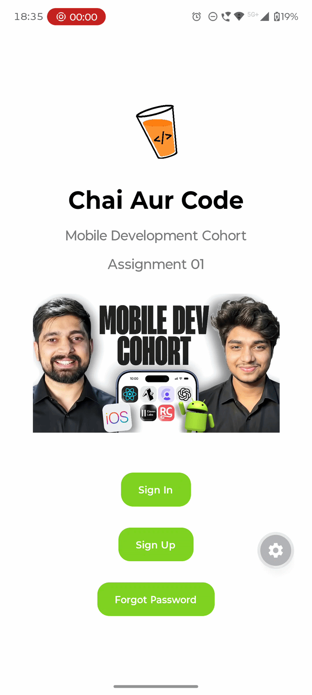
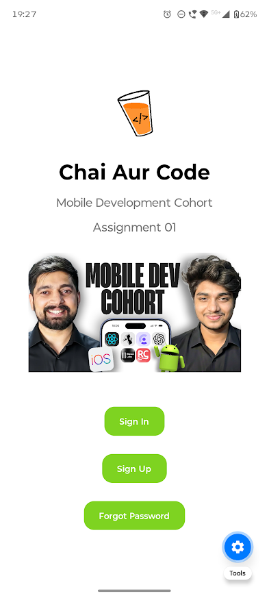
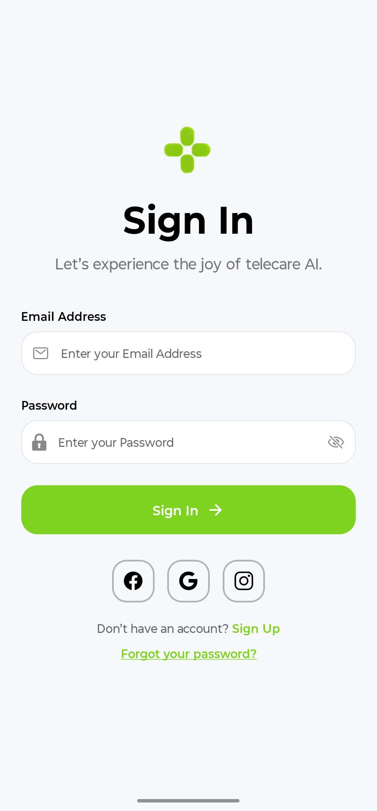
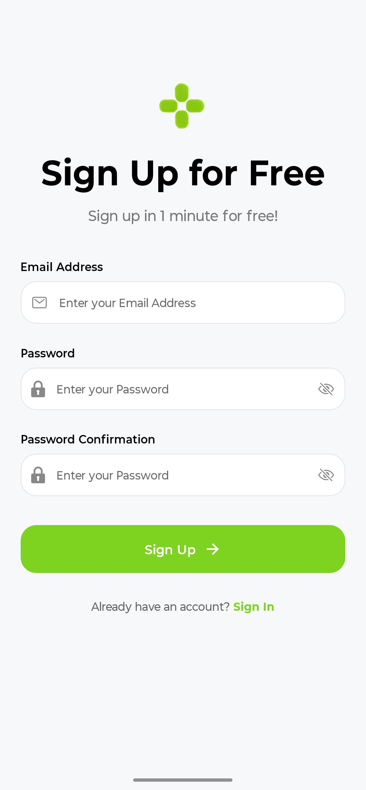
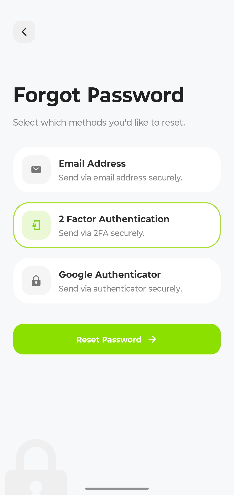

# Chai Aur Code Mobile Development Assignment 01

This is a simple authentication page using Expo. The goal is to implement a functional and user-friendly login and signup interface with styling.

## Project Video Preview



## Project Screenshots

### Extra Screen



<hr/>

### Sign In



<hr/>

### Sign Up



<hr/>

### Forgot Password



## Prerequisites

- Node.js has been downloaded and installed on your system.
- Must have any smart phone(iOS or Android)
- Expo Go app downloaded from the Play Store or App Store.

## How to Run the Project

### 1. Clone the Repository.

To get a copy of this project on your local machine, run the following commands:

```bash
git clone https://github.com/Mohd-Ujaid/Mobile-Developemnent-Assignment-01.git
```

### 2. Install dependencies

```
cd Mobile-Developemnent-Assignment-01
npm install
```

### 3. Start the development server

```
npx expo start
```

### 4. Run on your device

- Download the Expo Go app on your device (Android or iOS).
- Scan the QR code appearing in your terminal.
